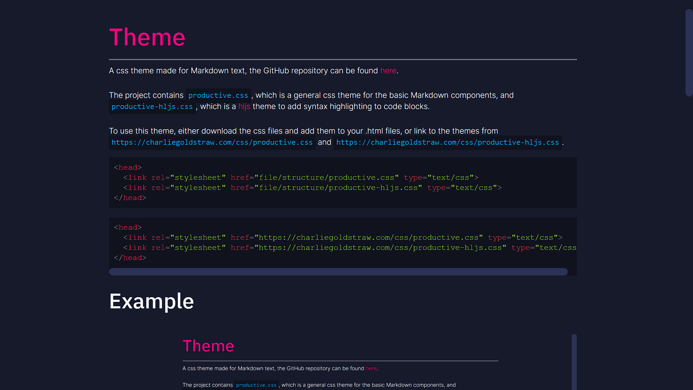

# Productive Theme
----

A css theme made for Markdown text, the GitHub repository can be found [here](https://github.com/CGoldstraw/Productive-Markdown-CSS).<br><br>

The project contains `productive.css`, which is a general css theme for the basic Markdown components, and `productive-hljs.css`, which is a [hljs](https://highlightjs.org/) theme to add syntax highlighting to code blocks.<br><br>

To use this theme, either download the css files and add them to your .html files, or link to the themes from `https://charliegoldstraw.com/css/productive.css` and `https://charliegoldstraw.com/css/productive-hljs.css`.

```html
<head>
  <link rel="stylesheet" href="file/structure/productive.css" type="text/css">
  <link rel="stylesheet" href="file/structure/productive-hljs.css" type="text/css">
</head>
```
```html
<head>
  <link rel="stylesheet" href="https://charliegoldstraw.com/css/productive.css" type="text/css">
  <link rel="stylesheet" href="https://charliegoldstraw.com/css/productive-hljs.css" type="text/css">
</head>
```

## Example


A sample webpage for this theme can be found [here](https://www.charliegoldstraw.com/projects/productive).

## Syntax Highlighting
You can use [any hightlight.js theme](https://highlightjs.org/static/demo/) with this project, or a theme is provided in `productive-hljs.css`.

## MIT License
This project uses the MIT license, so you may use it for private or commercial use and modify or distribute it freely.
